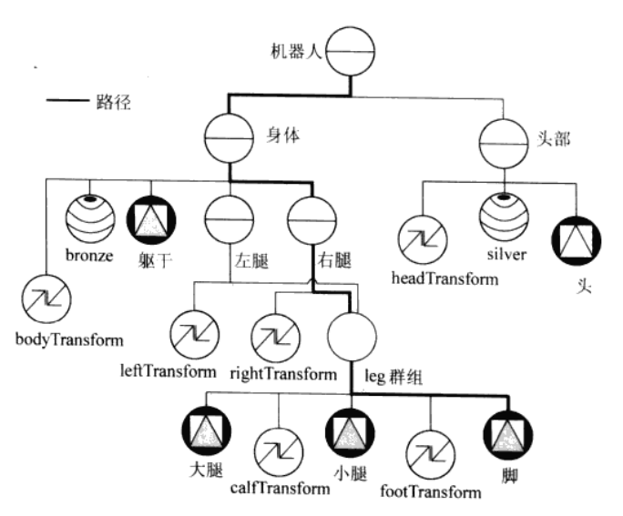
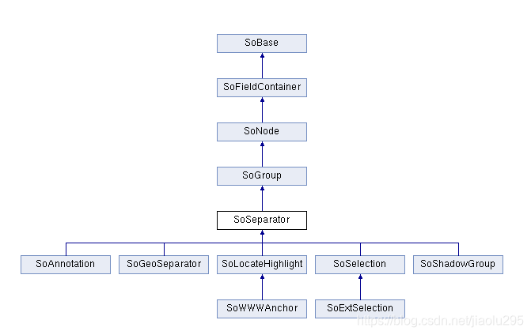
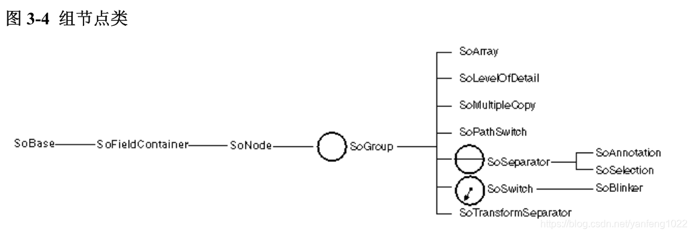
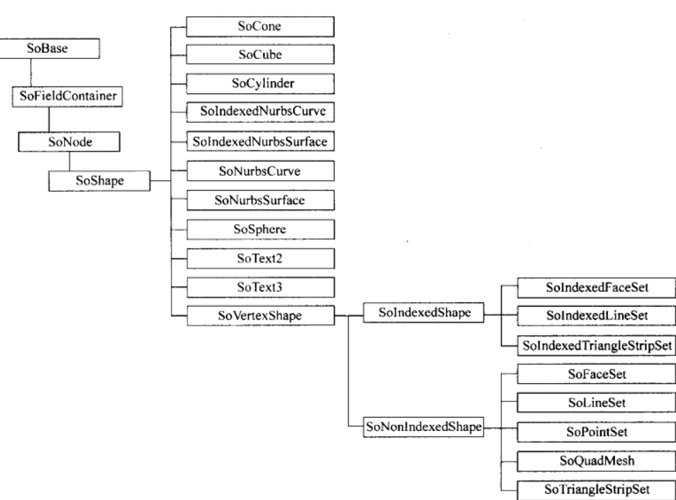
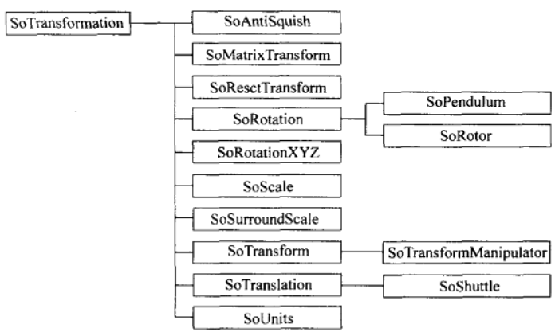

# Scene Graph

## 基本SceneGraph
### LearnOpenGL 

### Vtk
提供了scene graph的代码，但是paraview没有使用

### OpenInventor Toolkit
闭源的Open Inventor后续SDK
`https://developer.openinventor.com/refmans/2025.1/RefManCpp/index.html`
- Picking
    - 部分场景下，采用GPU Pick
    - optimized scene graph pipeline

### Coin3D
完成的Scene Graph

从左到右，从上到下的顺序遍历整个场景

- SoSeparator
    - SoSeparator节点的子图不会影响当前节点的状态，因为在遍历子图之前推送（push）遍历状态,在遍历子图之后弹出(pop)遍历状态.
    SoSeparator节点还通过使用缓存提供遍历优化选项。
    

- SoGroup
    
    - 如果当前渲染的节点是组节点，那么组节点将按照顺序对其每个子节点调用渲染动作，调用顺序通常都是按照子节点在场景中从左到右的顺序。
    - 如果当前渲染的节点是形体节点的话，那么形体节点将使用当前的遍历状态来绘制自己
    - 每个子节点依次执行它们自己的渲染方法，这些方法在某些方面会影响遍历状态（见第 9 章“应用动作”）。如果子节点是一个属性节点，那么它可能会修改诸如像散射光颜色、物体缩放比例、线宽度等当前遍历状态的元素数据。绝大多数的属性节点只是简单地（使用自己的数值）替换掉遍历状态中对应元素的数值(例如，青铜材质的节点将使用自己的数值替换掉遍历状态中当前材质的数值)。几何变换是一种例外情况，它们是彼此互相结合，累积产生合成变换。

#### 形状节点
- SoShape --> SoNode
virtual void GLRender(SoGLRenderAction * action);

- SoSphere --> SoShape
- SoCube --> SoShape
- SolndexedFaceSet

#### 属性节点
- 几何变换节点
SoTransformation

- SoMaterial

#### 节点增加删除与拆分

